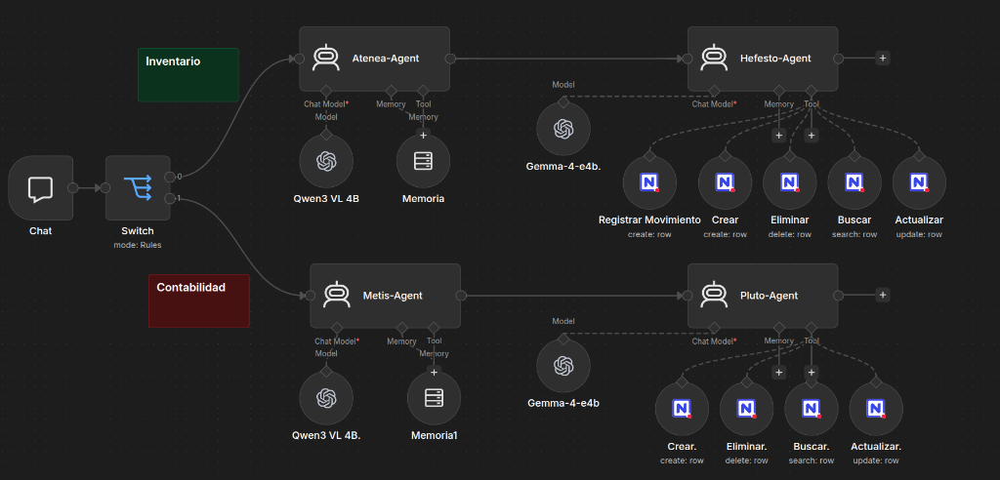

# Sistema Multi-Agente de Gestión Operativa (n8n + NocoDB)

[](https://www.docker.com/)
[](https://n8n.io/)
[](https://nocodb.com/)
[](https://ollama.com/)
[](https://www.langchain.com/)
[](LICENSE)

---

## Resumen Ejecutivo

Este documento especifica la arquitectura técnica, la infraestructura de despliegue y los principios de diseño del **Sistema Multi-Agente de Gestión Operativa**. Se trata de una solución distribuida local diseñada para la automatización de procesos de inventario y contabilidad mediante el procesamiento de lenguaje natural (NLP) y visión por computadora (VLM), transformando entradas no estructuradas (texto e imágenes) en transacciones deterministas sobre una base de datos relacional.

---

## Infraestructura y Entorno de Despliegue

### 1. Servidor Anfitrión y Contenedores (Ubuntu Server + Docker)

El sistema se despliega íntegramente sobre infraestructura contenedorizada para garantizar estabilidad de grado de producción, aislamiento de entornos y reproducibilidad.

| Componente | Tecnología | Función en la Arquitectura |
| :--- | :--- | :--- |
| **Sistema Operativo** | Ubuntu Server | Kernel anfitrión para la gestión eficiente de recursos y demonios de red. |
| **Orquestación** | Docker / Docker Compose | Aislamiento completo de procesos (*Sandboxing*) y gestión de volúmenes persistentes. |
| **Motor de Orquestación** | n8n | Motor de integración, enrutamiento lógico por reglas y control de flujo de agentes. |
| **Persistencia** | NocoDB | Base de datos relacional No-Code con interfaz REST interna. |
| **Inferencia de IA** | Ollama / Local LLM Host | Ejecución local de modelos de lenguaje sin salida a redes externas. |

### 2. Aislamiento y Red Privada (Air-Gapped Ready)

* **Privacidad de Grado Empresarial:** Toda la información de costos, inventario y registros contables se procesa de forma interna sin depender de API o servicios en la nube de terceros.
* **Seguridad por Diseño:** Los contenedores se comunican exclusivamente a través de una red virtual interna de Docker (`backend-network` bridge), manteniendo los puertos de la base de datos y motores de inferencia cerrados al exterior.
* **Alta Disponibilidad:** Gestión de persistencia mediante volúmenes montados y políticas de reinicio automático (`restart: unless-stopped`) bajo el demonio de Docker en Linux.

---

## Arquitectura de Inteligencia Artificial

### 1. Inferencia Determinista

Para evitar alucinaciones y garantizar la integridad transaccional en la base de datos:

* **Temperatura de Inferencia:** Configurada a valores cercanos a cero ($T \approx 0$).
* **Restricción Sintáctica:** Formateo estricto de salidas mediante *Tool Calling* y esquemas de comandos normalizados.

### 2. Visualización del Flujo de Orquestación (n8n)



*Figura 1: Implementación del flujo multi-agente en n8n. Se aprecia la segregación de tráfico por el nodo Switch hacia las ramas especializadas de Inventario y Contabilidad.*

### 3. Matriz de Agentes y Modelos

```
                     ┌─── [ inventario: ] ───> Atenea-Agent ───> Hefesto-Agent ───> NocoDB (Stock / Movimientos)  
[ Chat Trigger ] ───>│  
                     └─── [ contabilidad: ] ─> Metis-Agent  ───> Pluto-Agent   ───> NocoDB (Finanzas)
```

| Módulo | Agente | Rol Operativo | Modelo LLM / VLM | Herramientas e Integraciones |
| :--- | :--- | :--- | :--- | :--- |
| **Inventario** | **Atenea-Agent** | Supervisor: Parsing multimodal (OCR de facturas/remitos), normalización de jerga y traducción a comandos estandarizados. | Qwen3 VL 4B | Memoria de ventana conversacional. |
| **Inventario** | **Hefesto-Agent** | Ejecutor: Procesamiento en lote e invocación de herramientas de datos sobre el catálogo y movimientos. | Gemma-4-e4b | NocoDB Tools: *Registrar Movimiento*, *Crear*, *Eliminar*, *Buscar*, *Actualizar*. |
| **Contabilidad** | **Metis-Agent** | Supervisor: Interpretación semántica de intenciones financieras, validación de categorías e inferencia de flujos. | Qwen3 VL 4B | Memoria de ventana conversacional. |
| **Contabilidad** | **Pluto-Agent** | Ejecutor: Razonamiento (*Scratchpad*) y consolidación de asientos financieros en las tablas contables. | Gemma-4-e4b | NocoDB Tools: *Crear*, *Eliminar*, *Buscar*, *Actualizar*. |

---

## Esquema de Persistencia (NocoDB)

La base de datos se estructura en tres tablas relacionales dentro de NocoDB:

1. **Inventario**: Catálogo maestro de productos (`Producto`, `Costo_Pack`, `Venta_Pack`, `Unidad_Pack`, `Vendido`).
2. **Movimientos**: Registro histórico de entradas y salidas (`Producto`, `Precio`, `Cantidad`, `Total`, `Created_time`).
3. **Finanzas**: Historial contable global (`ID_Transaccion`, `Tipo_de_Flujo`, `Categoria_Contable`, `Concepto`, `Monto_Bruto`).

El proyecto incluye conjuntos completos de datos ficticios en la carpeta [`mock-data/`](mock-data/) para inicializar y probar inmediatamente el sistema sin exponer información confidencial.

---

## Estructura del Repositorio

```text
.
├── assets/
│   └── workflow.png                                    # Diagrama visual de la arquitectura n8n
├── mock-data/
│   ├── finanzas.csv                                   # Dataset de prueba para movimientos contables
│   ├── inventario.csv                                 # Dataset de prueba para catálogo de productos
│   └── movimientos.csv                                # Dataset de prueba para transacciones de stock
├── workflows/
│   └── sistema-multi-agente-gestion-operativa.json    # Definición JSON exportable del flujo n8n
├── .env.example                                       # Plantilla de variables de entorno (mock values)
├── .gitignore                                         # Reglas de exclusión de git
├── docker-compose.yml                                 # Orquestación de servicios (n8n, NocoDB, Ollama)
└── README.md                                          # Especificación técnica y documentación oficial
```

---

## Despliegue Rápido (Quick Start)

### 1. Clonar el Repositorio y Configurar Variables

```bash
git clone https://github.com/simbiosisia06-lang/sistema-multi-agente-gestion-operativa.git
cd sistema-multi-agente-gestion-operativa

# Copiar plantilla de entorno
cp .env.example .env
```

Ajustá los valores en `.env` según tus puertos y claves deseadas.

### 2. Iniciar Servicios con Docker Compose

```bash
docker compose up -d
```

Servicios levantados:
- **n8n Web UI**: `http://localhost:5678`
- **NocoDB Web UI**: `http://localhost:8080`
- **Ollama Inferencia**: `http://localhost:11434`

### 3. Descargar Modelos Locales en Ollama

```bash
# Modelo multimodal VLM para supervisores (Atenea y Metis)
docker exec -it ollama ollama run qwen:vl

# Modelo LLM determinista para ejecutores (Hefesto y Pluto)
docker exec -it ollama ollama run gemma:2b # o variante gemma equivalente
```

### 4. Importar Tablas y Datos de Prueba en NocoDB

1. Abrir `http://localhost:8080` y crear un proyecto / workspace.
2. Importar los tres archivos CSV ubicados en `mock-data/`:
   - `mock-data/inventario.csv` -> Tabla `Inventario`
   - `mock-data/movimientos.csv` -> Tabla `Movimientos`
   - `mock-data/finanzas.csv` -> Tabla `Finanzas`
3. Generar un **API Token** en la configuración de NocoDB.

### 5. Importar el Flujo en n8n

1. Acceder a `http://localhost:5678`.
2. Ir a **Workflows** > **Import from File...** y seleccionar `workflows/sistema-multi-agente-gestion-operativa.json`.
3. Configurar las credenciales para:
   - **NocoDB Token account**: ingresar la URL interna `http://nocodb:8080` y el API Token generado.
   - **OpenAI / Ollama Local account**: URL base `http://ollama:11434/v1` y clave simulada.
4. Activar el flujo.

---

## Ejemplos de Uso y Comandos

El chat trigger discrimina el contexto mediante el prefijo del mensaje:

### Dominio Inventario (`inventario:`)

* **Carga manual o jerga:**
  ```text
  inventario: Anotame 2 Brahma 1L y 4 Cono
  ```
* **Actualización de precios:**
  ```text
  inventario: Subile el costo a Cerveza Brahma 1L a 13000 y la venta a 19500
  ```
* **Lectura de remito o imagen:** Enviar una foto de remito o ticket adjuntando el mensaje:
  ```text
  inventario: Procesar remito de reposición adjunto
  ```
* **Balance global de inventario:**
  ```text
  inventario: Dame el estado general del inventario
  ```

### Dominio Contabilidad (`contabilidad:`)

* **Registro de movimiento:**
  ```text
  contabilidad: Registrá un egreso de 25000 por Mantenimiento concepto "Reparación de luminarias"
  ```
* **Consulta financiera agrupada:**
  ```text
  contabilidad: ¿Cuánto gastamos en total en proveedores este mes?
  ```
* **Resumen de flujo de caja:**
  ```text
  contabilidad: Mostrame un reporte de todos los ingresos y egresos registrados
  ```

---

## Estado Actual y Roadmap de Expansión

### Estado Actual (MVP Funcional)

* Ingesta multimodal local operativa (lectura visual de comprobantes y comandos de texto).
* Enrutamiento determinista por prefijo de dominio (`inventario:` y `contabilidad:`).
* Ejecución transaccional CRUD bidireccional sobre NocoDB.

### Roadmap (Open Backlog)

#### 1. Gobernanza y Control de Riesgo

* **Human-in-the-Loop (HITL):** Incorporación de un nodo de aprobación previa antes de ejecutar operaciones destructivas (`/eliminar`, `/actualizar`).
* **Pista de Auditoría (Audit Trail):** Tabla inmutable que registre `timestamp`, `agente`, `comando_ejecutado` y `id_usuario`.
* **Control de Acceso Basado en Roles (RBAC):** Autenticación en la capa de entrada para restringir comandos del módulo contable según nivel de autorización.

#### 2. Lógica de Negocio Avanzada

* **Validación de Stock Negativo:** Regla de control previo para bloquear transacciones de venta que superen las existencias actuales.
* **Punto de Reorden Automático:** Disparador para la generación de órdenes de compra cuando un producto alcance su umbral mínimo.

---

## Licencia

Distribuido bajo la Licencia MIT. Consultá [LICENSE](LICENSE) para más información.
